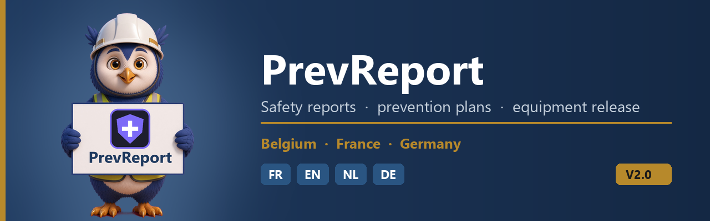
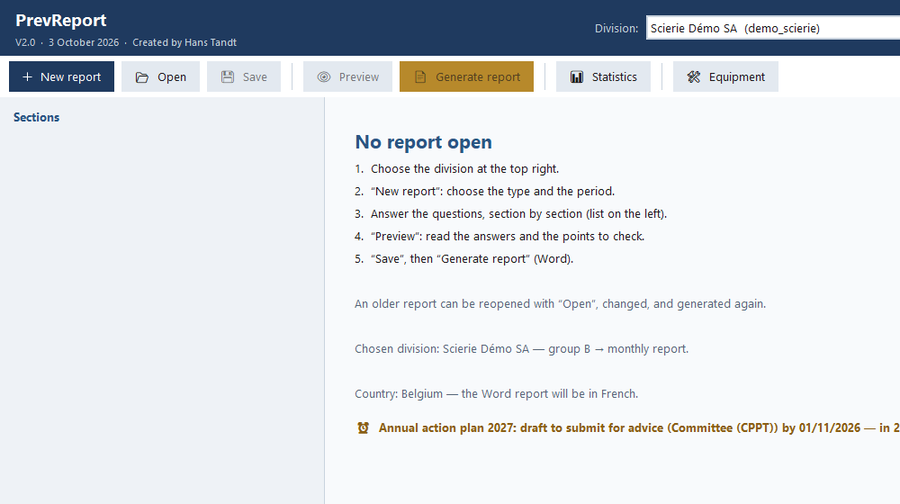
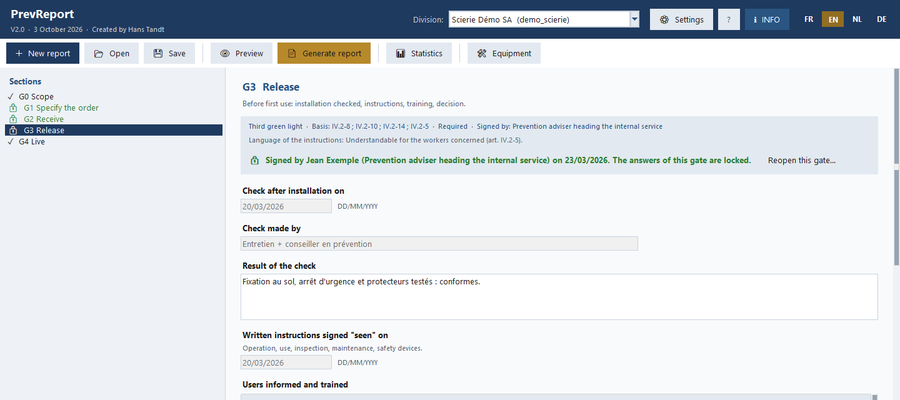
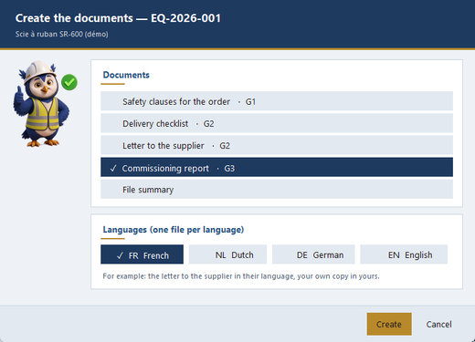
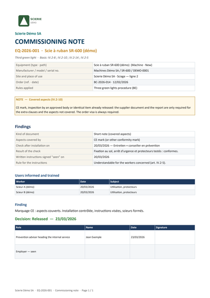

  

  <a href="../../releases/latest"><b>⬇&nbsp; Download PrevReport V2.0</b></a> &nbsp;·&nbsp;
  <a href="#-whats-new-in-v20">What's new</a> &nbsp;·&nbsp;
  <a href="#-evaluate-the-app--your-opinion-makes-it-better">Evaluate</a> &nbsp;·&nbsp;
  <a href="#-terms-of-use">Terms of use</a>

**PrevReport** is a Windows desktop app for prevention advisers. It asks you the questions, step by
step, saves your answers, and writes the Word documents for you — in the language of your division.

<table>
<tr>
<td width="96" align="center"></td>
<td><b>Safety reports</b> Belgium: SIPPT monthly / quarterly report and annual report form A. France and
Germany: their own periodic and annual reports. Accident rates calculated for you.</td>
</tr>
<tr>
<td align="center"></td>
<td><b>Prevention plans</b> The Belgian global prevention plan (up to 5 years) and the annual action plan,
filled in from each other and followed in the monthly reports.</td>
</tr>
<tr>
<td align="center"></td>
<td><b>Equipment release — new in V2.0</b> Buy, receive and release new work equipment in five steps,
with the signatures and the documents. In Belgium: the three green lights.</td>
</tr>
<tr>
<td align="center"></td>
<td><b>Four languages, offline</b> Screens and questions in English, French, Dutch and German. No internet
needed: your data stays on your PC.</td>
</tr>
</table>

  

## ✨ What's new in V2.0

- **Equipment release.** A new **Equipment** button opens the register of the division. One release file per
  machine, installation or mechanised tool, with five steps: scope, order, delivery, release, in service.
  Each step is signed; a CE mark is never a release on its own; the app shows what is still missing.
- **Documents in the language you choose.** Order clauses, delivery checklist, letter to the supplier,
  commissioning report or note, file summary, Committee list — one file per language (FR, NL, DE, EN), so the
  supplier gets the letter in their own language.
- **Links.** The release files appear in the monthly report and in the statistics (tab *Equipment*, Excel and PDF).
- **Belgium, France, Germany** each with their own rules; other countries use the EU base.
- **A new look.** The owl guides you in the pop-ups, on the start screen and in the manuals. Nicer windows,
  better contrast in every colour set.
- **Blank forms** to print and fill in by hand, for advisers who do not use the app yet (in the zip, folder
  `Manuals\Templates`).
- **Terms of use** shown at the first start, in your language.

  

<table>
<tr>
<td width="55%"></td>
<td></td>
</tr>
<tr>
<td align="center"><i>Choose the documents and the languages.</i></td>
<td align="center"><i>The commissioning note, ready to sign.</i></td>
</tr>
</table>

## ⬇ Download and start

1. Open **[Releases](../../releases/latest)** and download `PrevReport_V2.0.zip`.
2. Unzip it in a folder where you can write (Desktop or Documents — not `C:\Program Files`).
3. Double-click `PrevReport.exe`. Nothing else to install.
4. Read and accept the terms of use (first start only).

On the first start the app uses the demo data in `Test_Folder` (fictitious companies), so you can
try everything at once. For real work: ⚙ Settings → Folders. The user manual (EN / FR / NL / DE)
opens with the **INFO** button.

> [!NOTE]
> Windows may warn that the app is from an unknown publisher (it is not signed): click
> **More info → Run anyway**.

## 🔄 New versions

At start the app checks whether a newer version is available here. If so, a gold **New version**
button appears at the top; it opens this download page. The app only asks GitHub which version is
the newest: no data is sent and nothing is installed. Turn it off in ⚙ Settings → Start.

To update: download the new zip, unzip it and start it. Your reports and settings are kept — they
are not in the app folder.

## 💬 Evaluate the app — your opinion makes it better

PrevReport was built from the official forms and rules, but you use it on real sites. Only real use
shows what is slow, unclear, missing — or wrong. A wrong rule counts most: tell us the document and
article. Every answer is read; the agreed changes go into the next version. About 15 minutes.

| Language | Answer online | Or use the document |
|---|---|---|
| English | [Evaluation (English)](../../issues/new?template=evaluation_en.yml) | [PDF](Evaluation/PrevReport_Evaluation_EN.pdf) · [Word](Evaluation/PrevReport_Evaluation_EN.docx) |
| Français | [Évaluation (français)](../../issues/new?template=evaluation_fr.yml) | [PDF](Evaluation/PrevReport_Evaluation_FR.pdf) · [Word](Evaluation/PrevReport_Evaluation_FR.docx) |
| Nederlands | [Evaluatie (Nederlands)](../../issues/new?template=evaluation_nl.yml) | [PDF](Evaluation/PrevReport_Evaluation_NL.pdf) · [Word](Evaluation/PrevReport_Evaluation_NL.docx) |
| Deutsch | [Bewertung (Deutsch)](../../issues/new?template=evaluation_de.yml) | [PDF](Evaluation/PrevReport_Evaluation_DE.pdf) · [Word](Evaluation/PrevReport_Evaluation_DE.docx) |

Answering online needs a free GitHub account. A filled-in document can be attached to a new issue.

> [!CAUTION]
> Issues are **public**: everybody can read them. Never write the names of people or of your
> company, and no confidential data.

## 📜 Terms of use

PrevReport — © 2026 Hans Tandt. All rights reserved.

- You may use this version **free of charge for your own work**.
- You may not sell it, change it, copy it into another product or pass it on as your own.
- PrevReport is a **test version**: use it at your own risk, check its results and keep your own copies
  of your data. It guides and records; **it is not legal advice**.

The rules in the app come from the official Belgian FPS forms and notice, the Belgian Code on
well-being at work, and the laws of France and Germany listed in the manual.

## ❓ Questions, remarks, a new country

Open an **[issue](../../issues)** in this repository.

Created by Hans Tandt — <a href="https://github.com/Hans-Tandt">github.com/Hans-Tandt</a>

